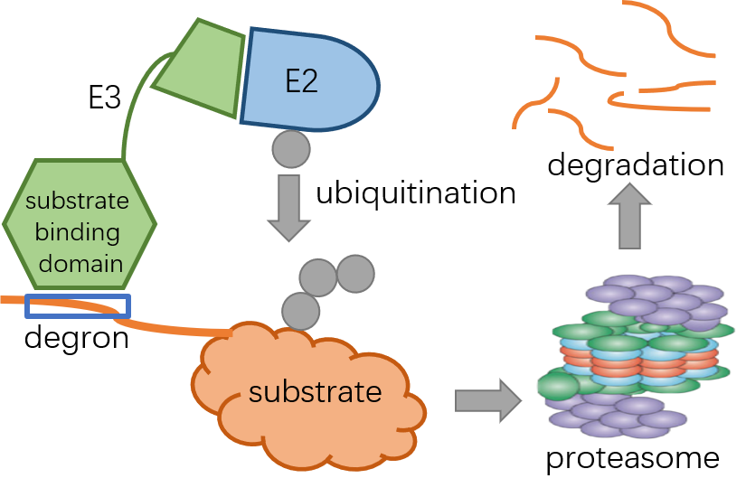

# Degpred
**A deep learning model to predict E3 binding sites (degrons) on protein substrates.**
    
    Pre-requisite
    python 3.7.4
    pytorch 1.4.0
    tape-proteins 0.4 <https://github.com/songlab-cal/tape>

## Introduction
**Degrons** are short linear motifs, bound by **E3 ubiquitin ligases** to target protein substrates to be degraded by the **ubiquitin-proteasome system**. Deregulation of degron disrupts control of protein abundance due to the mis-targeting of proteins destined for degradation and often results in pathologies. Despite their important function, identifying degrons remains a conundrum. Here, we developed a deep learning model called **Degpred** to predict degrons from protein sequences. Degpred successfully captures typical degron-related sequence properties and predicts degrons beyond those from motif-based methods which use a handful of E3 motifs to match possible degrons. Furthermore, to construct a regulatory system for protein degradation, we calculated motifs for E3s using predicted degrons on the substrates in our collected E3-substrate interaction dataset and assigned predicted degrons to specific E3s with calculated motifs.

## Model
We built a deep learning architecture that consists of a [pre-trained BERT based model](https://github.com/songlab-cal/tape), two bidirectional long short-term memory layers and two fully connected layers. The architecture took a protein sequence as input, and outputted scores for all AAs on the protein.

We collected 303 known degrons from ELM database and three previous studies and augmented known degrons by peptides sampling: for each degron, we randomly sampled ten peptides of 128 AAs containing the degron from the protein. We generated 3030 128-peptide containing known degrons.  

We grouped known degrons into 5 clusters by sequence alignment. Next, we built five models and trained each model on degrons from four clusters and tested each model on degrons of the remaining cluster. As Model 1-5 represent different aspects of properties of degrons, we assembled five models to build Degpred to take full advantage of known degrons and provide more comprehensive predictions. Degpred averages outputs from 5 models to score all AAs of the input protein. Taking 0.3 as the cut-off, we predicted 46,621 degrons on human proteome.

To generate motifs, we first collected an ESI dataset from PubMed and related databases. We chose 55 E3s with more than 10 substrates in the collected ESI dataset for motif calculation. We used GibbsCluster to align predicted degrons on substrates of each E3 and drop the outliers which fail to match with other degrons of the E3 and might constitute binding sites of other E3s. Subsequently, we generated motifs from the aligned Degpred degrons.

## Others
For detailed introduction of Degpred, you can refer to the website <http://degron.phasep.pro/>.
